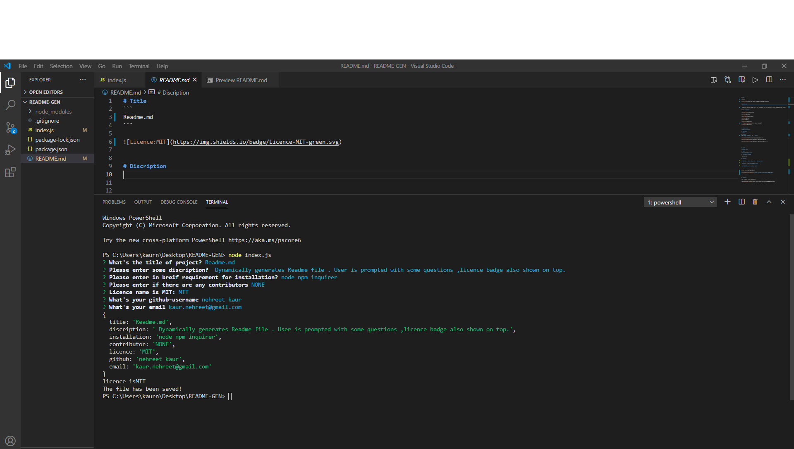
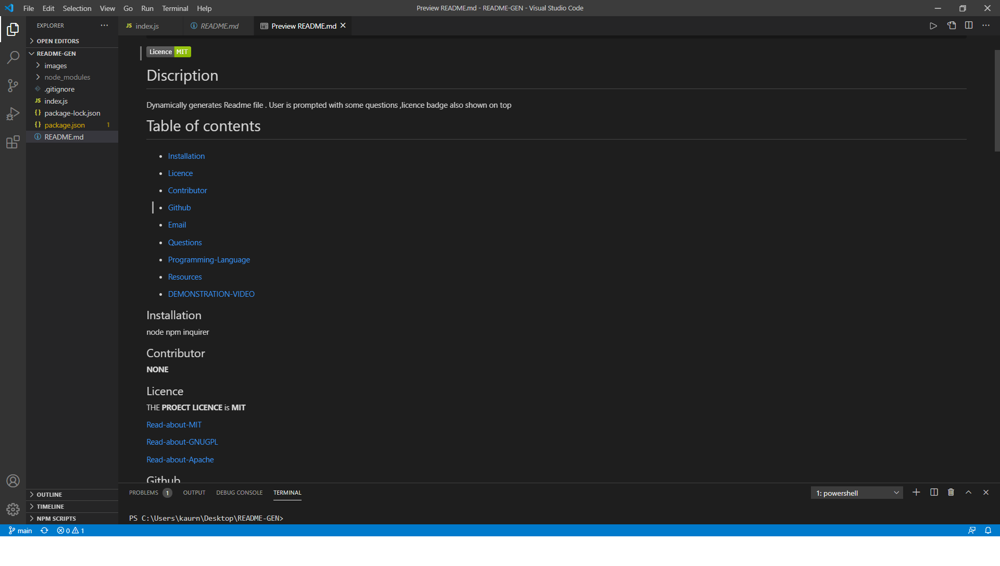

# Title
```
  README
```


 

# Discription 


Dynamically generates Readme file . User is prompted with some questions ,licence badge also shown on top


# Table of contents


* [Installation](#installation)


* [Licence](#licence)

* [Contributor](#contributor)

* [Github](#github)

* [Email](#email)

* [Questions](#questions)

*  [Programming-Language](#Programming-Language ) 

* [Resources](#resources)

* [DEMONSTRATION-VIDEO](#DEMONSTRATION-VIDEO)


## Installation

node npm inquirer

## Contributor
**NONE**


## Licence
THE   **PROJECT LICENCE**      is       **MIT**


[Read-about-MIT](https://opensource.org/licenses/MIT)

[Read-about-GNUGPL](https://opensource.org/licenses/gpl-3.0)

[Read-about-Apache](https://opensource.org/licenses/Apache-2.0)


## Github 

nehreet kaur

## Email

 kaur.nehreet@gmail.com

## Programming-Language 
```
  Java-Script
 ```

## Questions


FEEL FREE TO CONTACT ME IN CASE OF ANY QUESTIONS


 E-Mail:   kaur.nehreet@gmail.com


GITHUB-USERNAME:  nehreet kaur


[My-GIT-hub](https://github.com/)


[MY-Github-Project-Repository](https://github.com/nehreetkaur/README-GEN)


## Resources

[FOR LICENCE]( https://shields.io/)


[ANOTHER-RESOURCE-REFERRED](https://gist.github.com/lukas-h/2a5d00690736b4c3a7ba)


## DEMONSTRATION-VIDEO
[VIDEO-DEMO](https://drive.google.com/file/d/1g1MP9RLnj9X3DWB-tGdyxInY9PpQPBZf/view)


### GIF-DEMO


### SCREEN-SHOT







